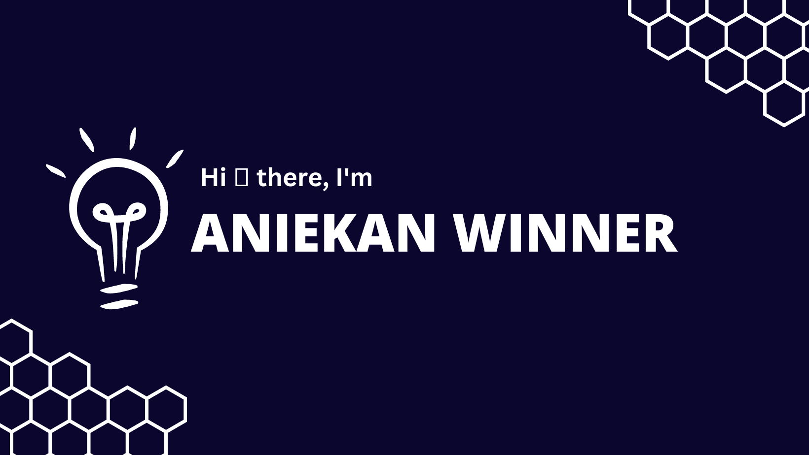

 

:student: I’m currently a full-stack Software Development student at Microverse.
 
:sunglasses: I’m looking to collaborate and build awesome projects.
 
💬 Ask me anything, or let's just build and play with codes.
 
:video_game: Fun fact: I love gaming, movies and reading.

## 🌐 Socials:
   

# 💻 Tech Stack:
    

# 📊 GitHub Stats:
 
 

## 🏆 GitHub Trophies

### 🔝 Top Contributed Repo

---
#  <i> 💡 Reminder </i> <h4> 📌 You may Check out my pinned projects below </h4>   
